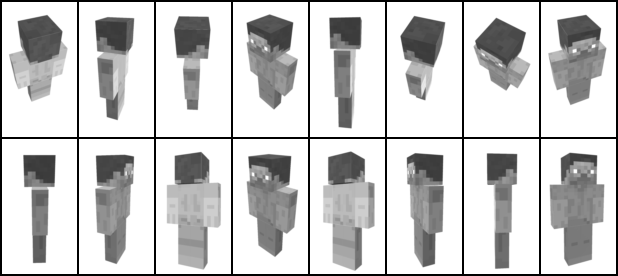

# Generative modeling projects

Small projects where I present my results when training generative models.

## 3D Minecraft Steve
For this project, I utilized my [gan-kit](https://github.com/willdalh/gan-kit).
I experimented with a self-made dataset consisting of different perspectives of Steve because I was curious to see how interpolations between two arbitrary latent vectors would create an animation. For models trained on faces, interpolations between two latent vectors will generate a smooth transition as seen [here](https://miro.medium.com/max/960/0*dwtvGrRWRAUJuZm4.gif).

### Dataset

I created the dataset by importing a [3D-model of Steve](https://sketchfab.com/3d-models/minecraft-steve-cb228dcc137042cc9a3dc588758cc6e9) into Unity and creating a script that would revolve around the model and capture images from different angles. A subset of the dataset is visualized below, with rescaling applied and colors removed.

### Generating perspectives of Steve

With a trained model, I generate different perspectives using arbitrary latent vectors.

The generator quickly learnt that it is not necessary to create images showing Steve's face, as it is more detailed than the back of his head, and that the discriminator would still accept these. Therefore, most inputs will result in images showing the back of Steve.

### Generating animations

The three GIFs below shows how interpolating between latent vectors simulates a rotation animation.
|<!-- --> |<!-- --> |<!-- --> |
:---:|:---:|:---:
 |  | 

An interesting effect occured where a certain point between two vectors would switch the direction the model faces. This can be seen in the two GIFs below.

| Switch front to back | Switch back to front |
:---:|:---:  
 |  
